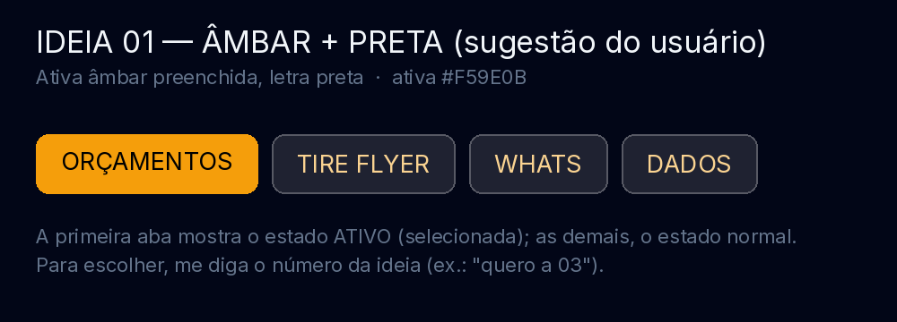
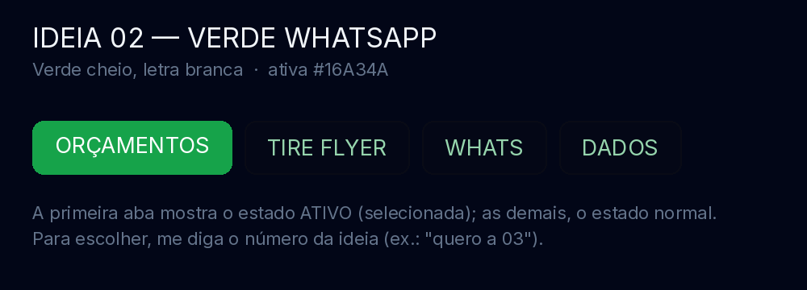
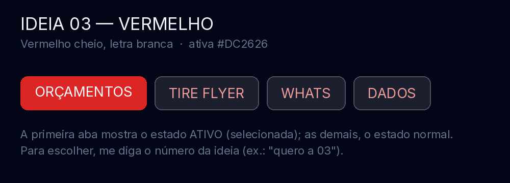
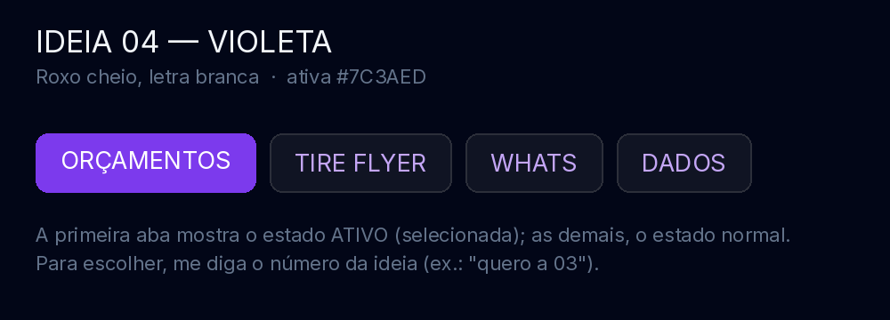
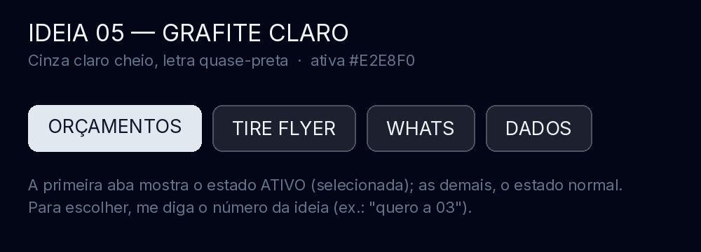
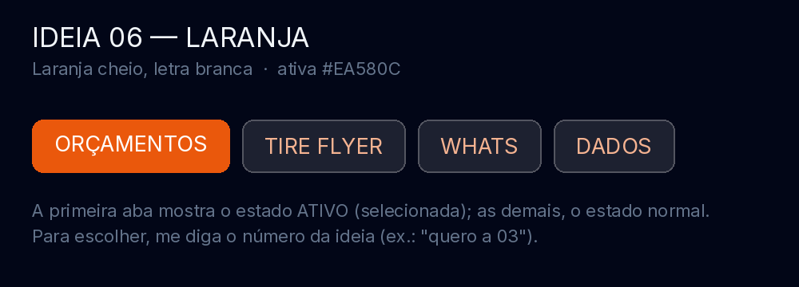
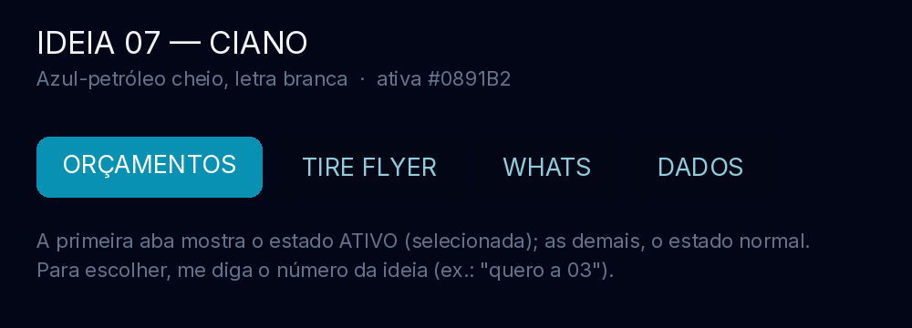
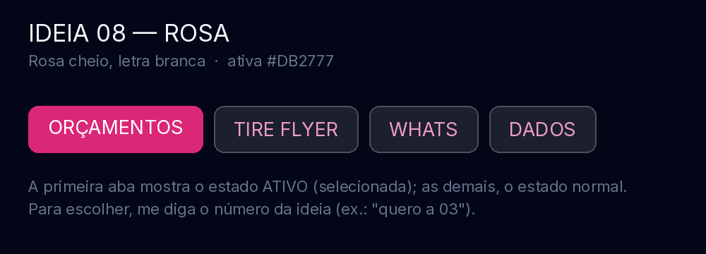
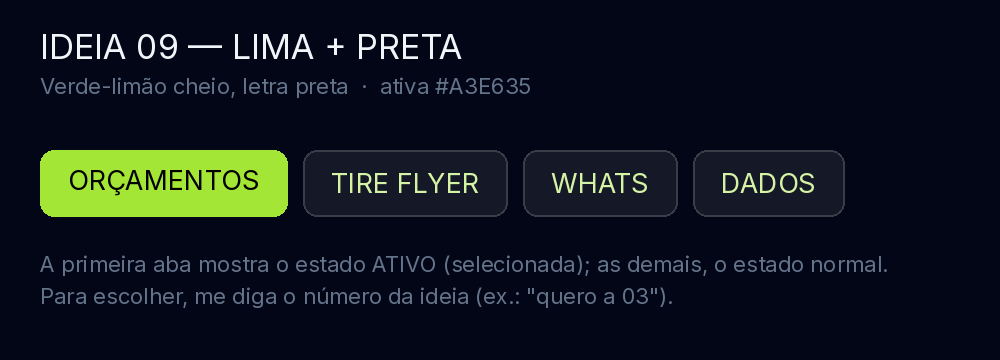
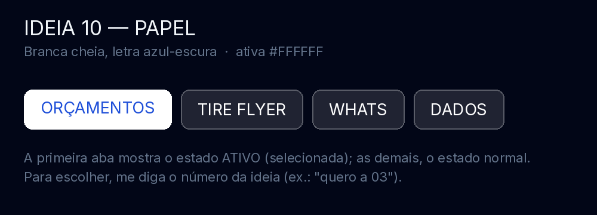

# 10 ideias — cor dos botões das abas superiores

Botões: **Orçamentos · Tire Flyer · Whats · Dados**. Em cada imagem, a primeira aba
mostra o estado **ativo** (selecionada) e as demais o estado normal. O estilo continua
o mesmo (pílula, maiúsculas); só muda a cor.

**Para escolher, diga o número** (ex.: "quero a 01"). Vale pedir ajuste fino depois
(ex.: "a 03 mas com a letra maior").

## Ideia 01 — Âmbar + preta (sugestão do usuário)

Ativa âmbar preenchida (`#F59E0B`), letra preta; demais em fantasma âmbar.

## Ideia 02 — Verde WhatsApp

Ativa verde cheia (`#16A34A`), letra branca; demais em fantasma verde.

## Ideia 03 — Vermelho

Ativa vermelha cheia (`#DC2626`), letra branca; demais em fantasma vermelho.

## Ideia 04 — Violeta

Ativa roxa cheia (`#7C3AED`), letra branca; demais em fantasma violeta.

## Ideia 05 — Grafite claro

Ativa cinza-clara cheia (`#E2E8F0`), letra quase-preta (`#0F172A`); demais em fantasma cinza.

## Ideia 06 — Laranja

Ativa laranja cheia (`#EA580C`), letra branca; demais em fantasma laranja.

## Ideia 07 — Ciano

Ativa azul-petróleo cheia (`#0891B2`), letra branca; demais em fantasma ciano.

## Ideia 08 — Rosa

Ativa rosa cheia (`#DB2777`), letra branca; demais em fantasma rosa.

## Ideia 09 — Lima + preta

Ativa verde-limão cheia (`#A3E635`), letra preta; demais em fantasma lima.

## Ideia 10 — Papel

Ativa branca cheia (`#FFFFFF`), letra azul-escura (`#1D4ED8`); demais em fantasma claro.

