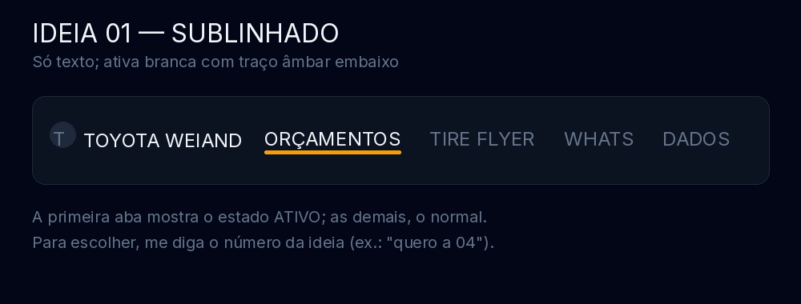
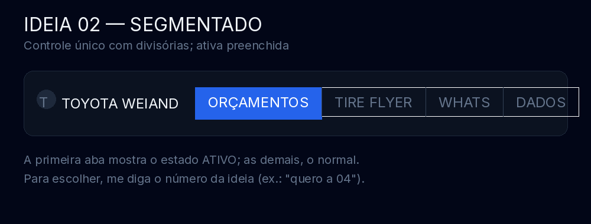
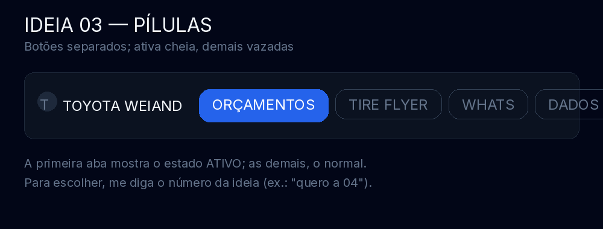
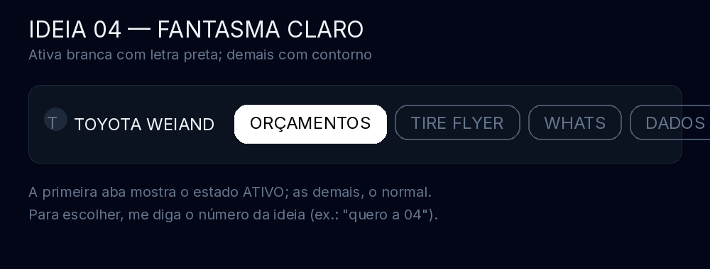
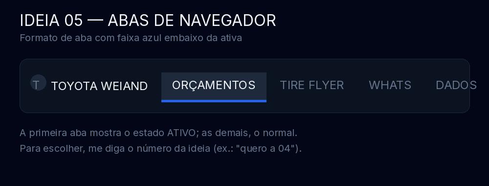
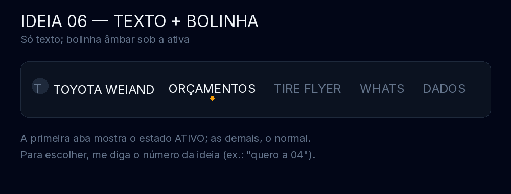
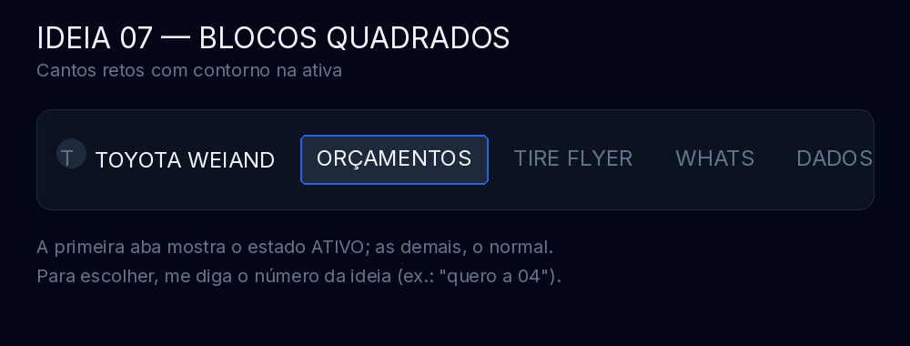
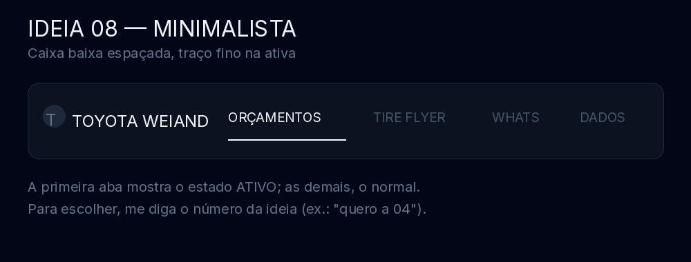
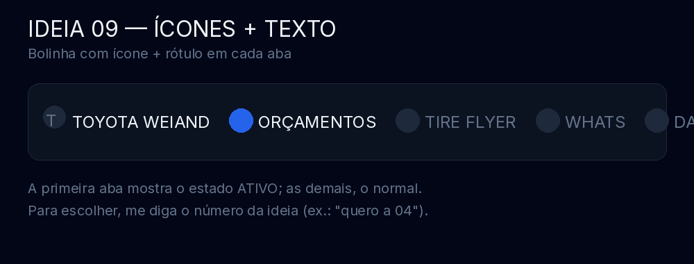
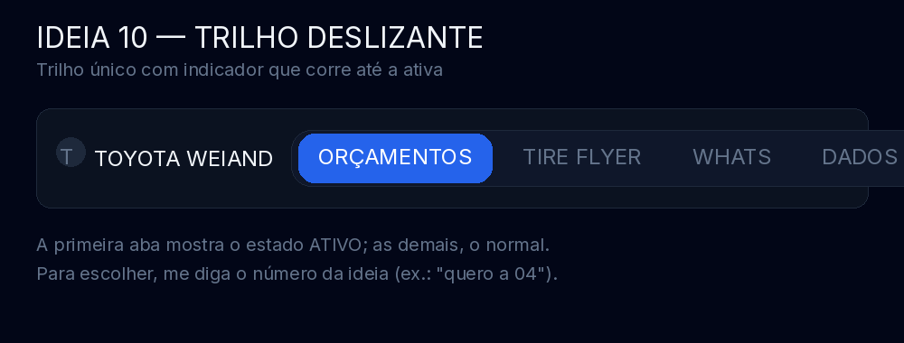

# 10 ideias — estilo das abas superiores

Botões: **Orçamentos · Tire Flyer · Whats · Dados**. Agora a proposta é o **estilo**
(formato), não só a cor — a cor da ativa segue o tema (azul, ou âmbar no grafite).
Em cada imagem, a primeira aba mostra o estado **ativo** e as demais o normal.

**Para escolher, diga o número** (ex.: "quero a 04"). Vale pedir ajuste fino depois.

## Ideia 01 — Sublinhado

Só texto; ativa branca com traço âmbar embaixo.

## Ideia 02 — Segmentado

Controle único com divisórias; ativa preenchida.

## Ideia 03 — Pílulas

Botões separados; ativa cheia, demais vazadas (é o estilo atual).

## Ideia 04 — Fantasma claro

Ativa branca com letra preta; demais só com contorno.

## Ideia 05 — Abas de navegador

Formato de aba com faixa azul embaixo da ativa.

## Ideia 06 — Texto + bolinha

Só texto; bolinha âmbar sob a ativa.

## Ideia 07 — Blocos quadrados

Cantos retos com contorno na ativa.

## Ideia 08 — Minimalista

Caixa baixa bem espaçada, traço fino na ativa.

## Ideia 09 — Ícones + texto

Bolinha com ícone + rótulo em cada aba.

## Ideia 10 — Trilho deslizante

Trilho único com indicador que corre até a ativa.

