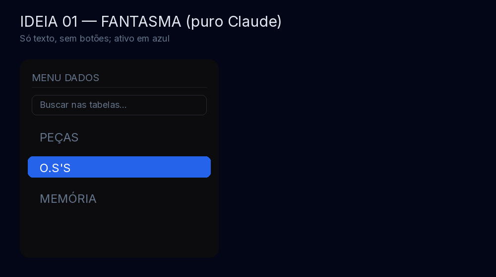
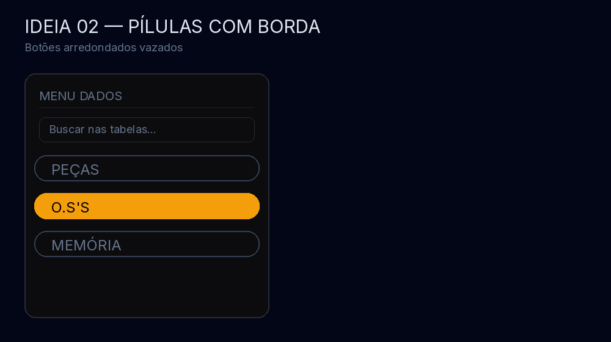
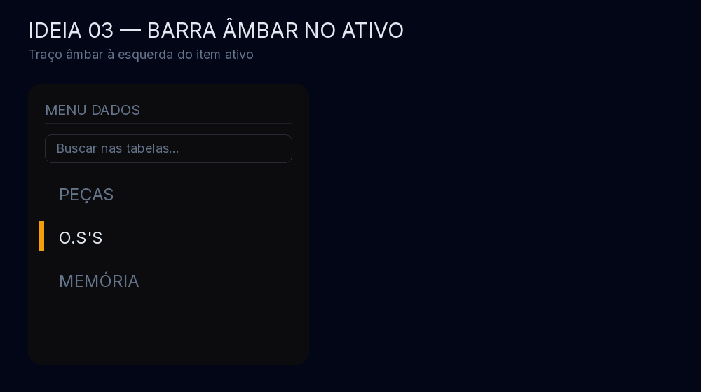
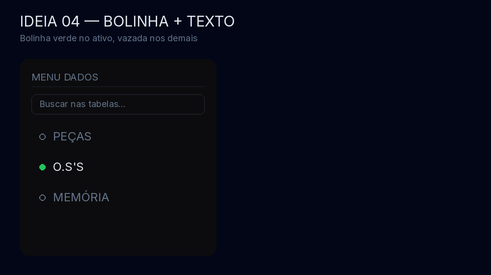
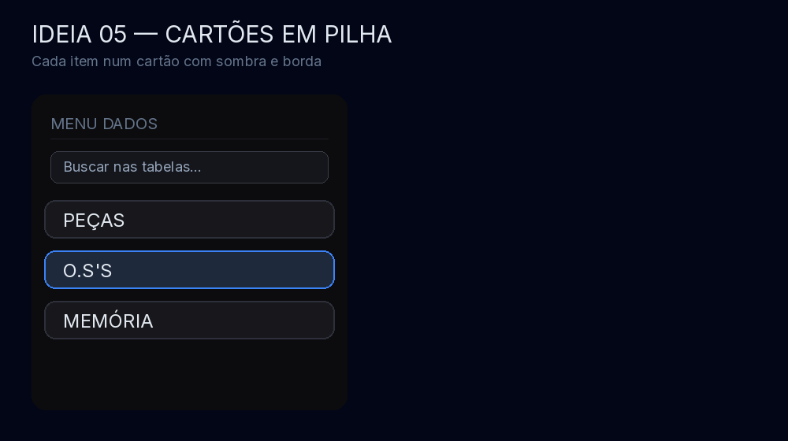
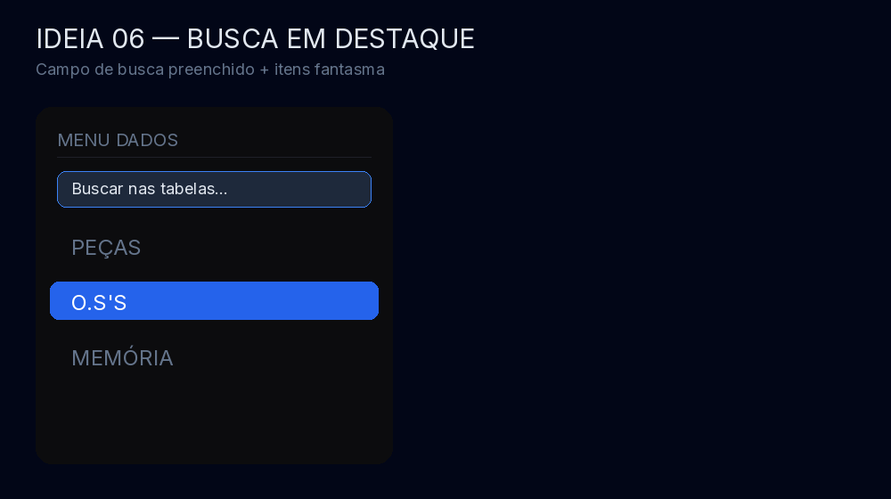
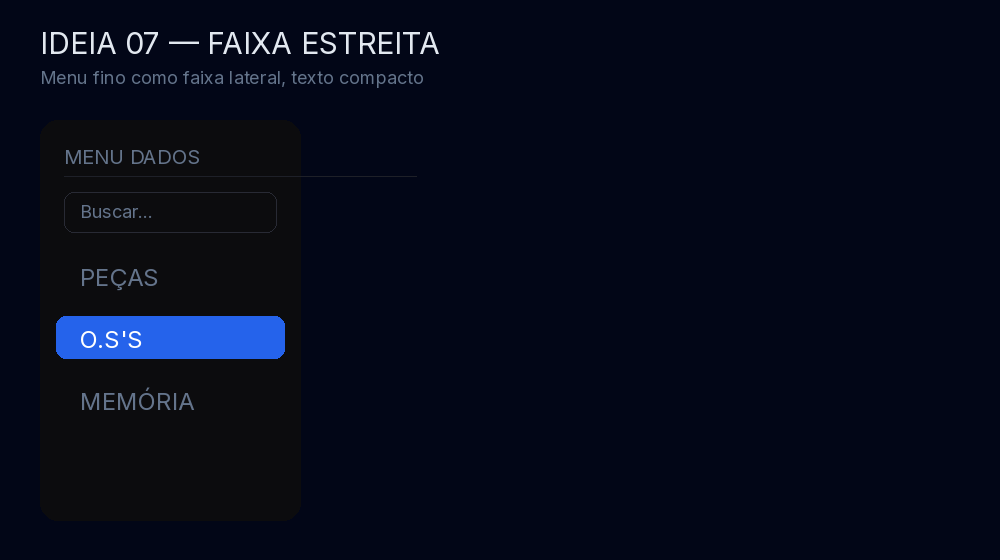
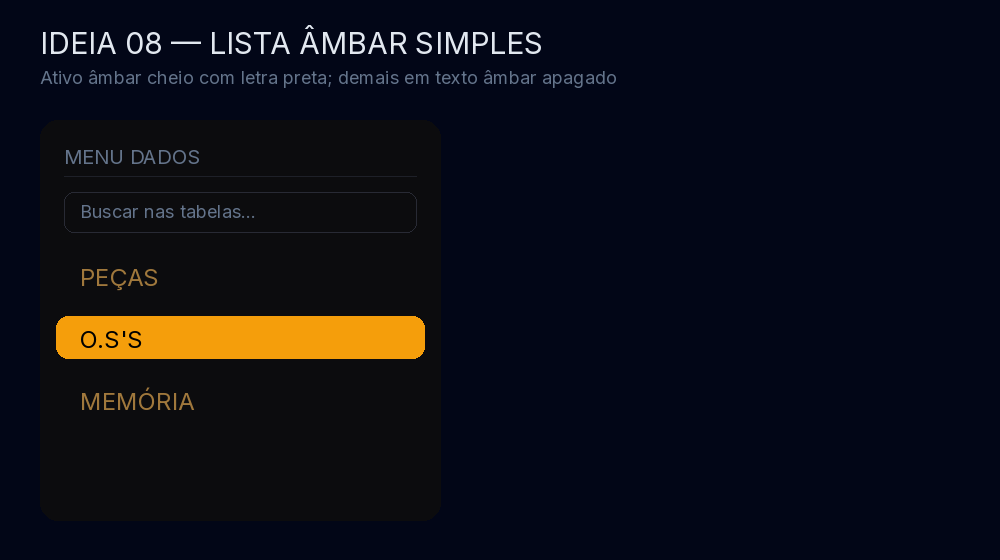

# 8 ideias — MENU DADOS (lateral esquerda, estilo Claude)

Troca do SUB ATALHOS (faixinha cinza à direita) por um menu à esquerda, quase-preto
como o fundo, chamado **MENU DADOS**: campo de busca + um item por sub-aba de Dados.
Em cada imagem, a sub-aba ativa é **O.S'S**.

**Para escolher, diga o número** (ex.: "quero o 03"). Vale pedir ajuste fino depois.

## Ideia 01 — Fantasma (puro Claude)

Só texto, sem botões; ativo em azul.

## Ideia 02 — Pílulas com borda

Botões arredondados vazados; ativo âmbar com letra preta.

## Ideia 03 — Barra âmbar no ativo

Traço âmbar à esquerda do item ativo, resto em texto.

## Ideia 04 — Bolinha + texto

Bolinha verde no ativo, vazada nos demais.

## Ideia 05 — Cartões em pilha

Cada item num cartão com borda; ativo com borda azul.

## Ideia 06 — Busca em destaque

Campo de busca preenchido + itens fantasma.

## Ideia 07 — Faixa estreita

Menu fino como faixa lateral, texto compacto.

## Ideia 08 — Lista âmbar simples

Ativo âmbar cheio com letra preta; demais em texto âmbar apagado.

