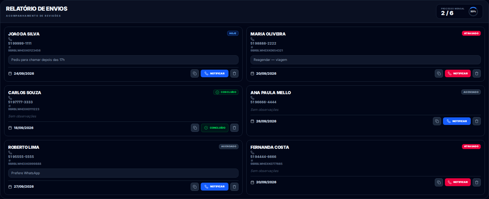
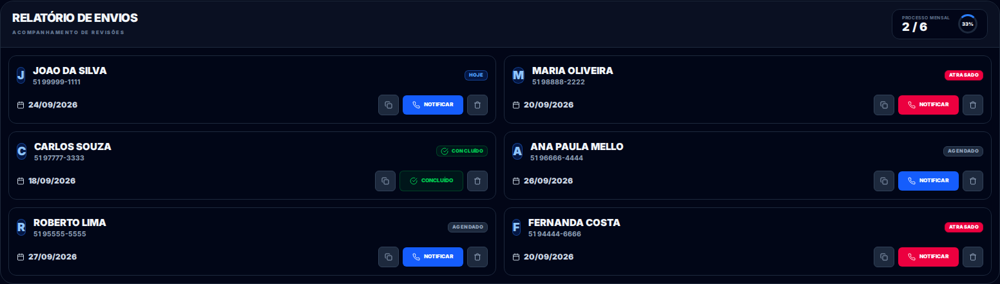
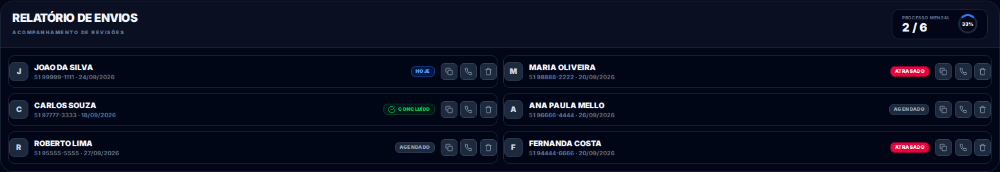
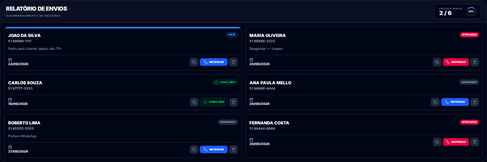
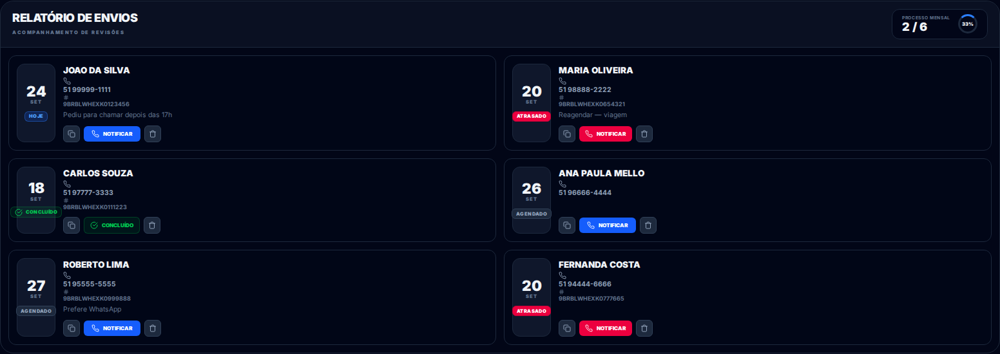
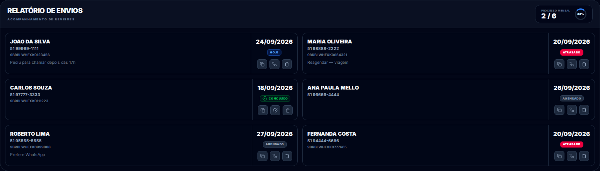
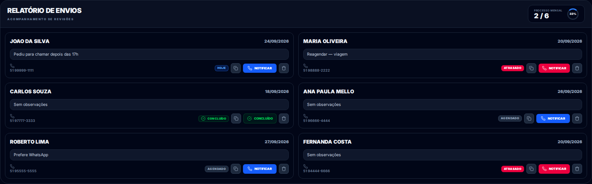
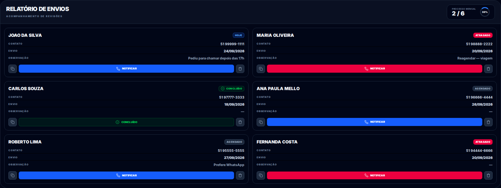
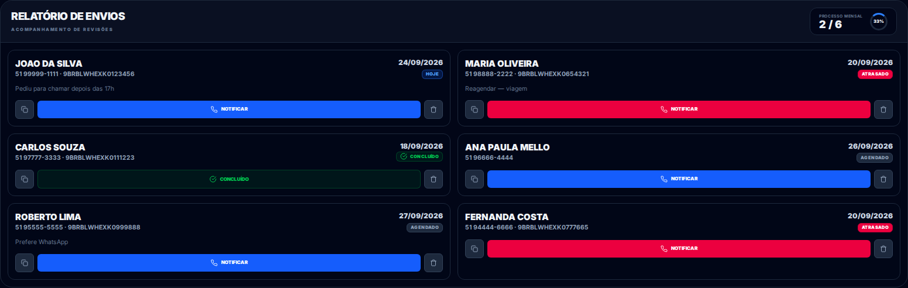
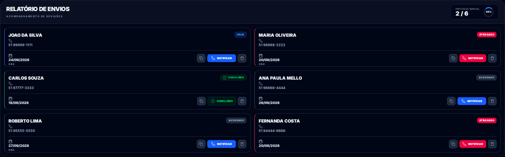

# Ideias de layout — Relatório de Envios em **2 colunas**

10 variações de cartões em 2 colunas (dados de exemplo; nada implementado ainda). Clique nas
imagens para ampliar. Me diga o número (pode combinar, ex.: "a 2 com o botão da 9") que eu aplico.

Todas mantêm o cabeçalho do relatório (Processo mensal / %) e aumentam a fonte do cliente para
18–20px — o problema atual era a linha comprida com letra miúda.

---

## Opção 1 — Clássico
Nome grande + contato/chassi, observação em caixa e rodapé com data e ações.
**Prós:** completo e legível. **Contras:** o mais alto de todos.

## Opção 2 — Avatar grande
Inicial em destaque, nome em 20px, data e ações maiores.
**Prós:** muito legível, ótimo no balcão. **Contras:** ocupa bem a altura.

## Opção 3 — Linha baixa
Uma linha só por cartão (inicial + nome/contato/data + ícones).
**Prós:** mostra quase 2x mais contatos por tela. **Contras:** sem observação visível.

## Opção 4 — Faixa de status
Barra colorida no topo (azul hoje / vermelho atrasado / verde concluído).
**Prós:** status num relance. **Contras:** faixa fina pode passar despercebida.

## Opção 5 — Data em bloco
Quadrado com dia/mês grande à esquerda + situação; dados e ações à direita.
**Prós:** destaca quando vence cada envio. **Contras:** cartão fica mais largo por dentro.

## Opção 6 — Dividido ao meio
Esquerda: cliente/contato/observação. Direita: data, situação e ícones.
**Prós:** organização clara em blocos. **Contras:** menos espaço para nomes longos.

## Opção 7 — Foco na observação
A nota fica em destaque no meio do cartão.
**Prós:** ótimo para quem usa muito a observação. **Contras:** nome/data mais discretos.

## Opção 8 — Ficha com rótulos
Linhas "Contato / Envio / Observação" com rótulos e **Notificar** largo.
**Prós:** muito organizado, parece uma ficha. **Contras:** um pouco mais alto.

## Opção 9 — CTA largo
Dados em cima, data/situação à direita e **Notificar** ocupando a largura.
**Prós:** clique principal grande e fácil. **Contras:** menos destaque para a observação.

## Opção 10 — Borda colorida
Barra de cor à esquerda por situação (como a ideia 5 da outra lista, mas em cartões 2 colunas).
**Prós:** elegante e discreto. **Contras:** precisa aprender o código de cores.

---

### Comparando com as 10 primeiras
Na primeira lista, as opções de 2 colunas eram a **1** (clássico) e a **7** (avatar grande).
Aqui elas viram **Opção 1** e **Opção 2** e ganharam 8 variações novas.

### Minha recomendação
- **Melhor equilíbrio:** **Opção 2** (avatar + nome 20px + ações grandes).
- **Para ver mais contatos:** **Opção 3** (linha baixa) — a mais compacta.
- **Para organizar/consultar:** **Opção 8** (ficha com rótulos).
- **Se observação é importante:** **Opção 7**.

Me responda com o número (ou mistura) que eu implemento na aba Whats.
