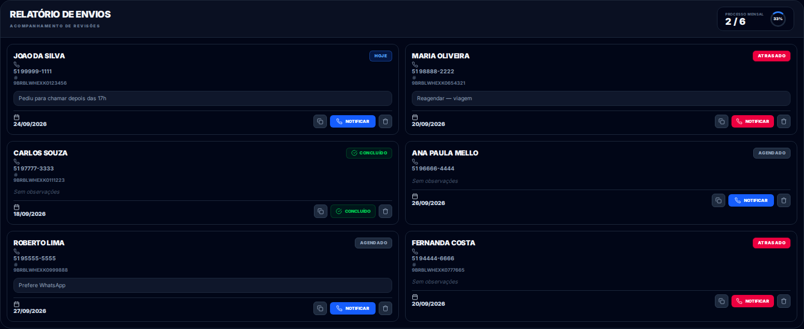
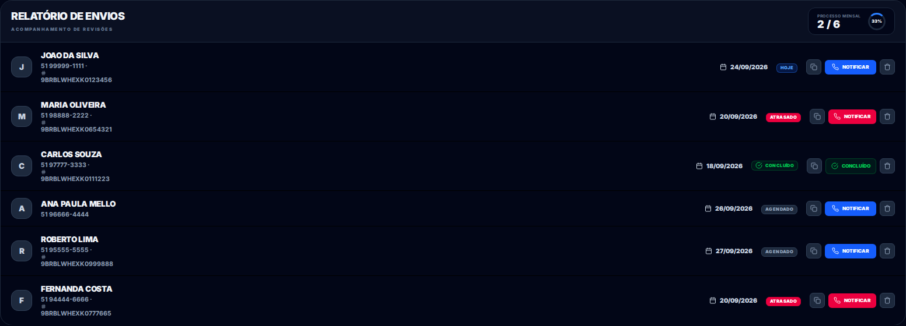
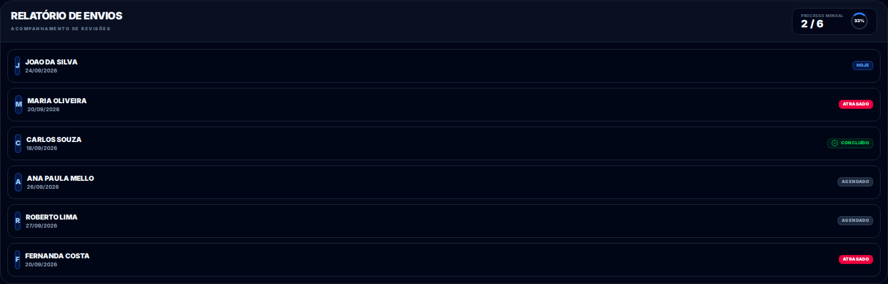
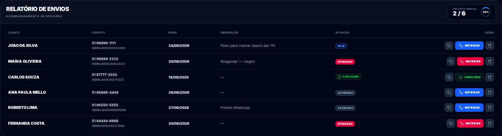
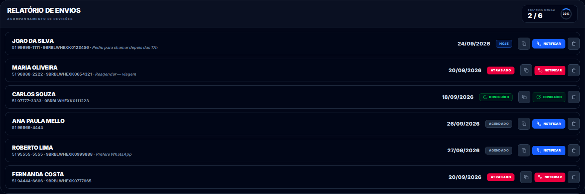
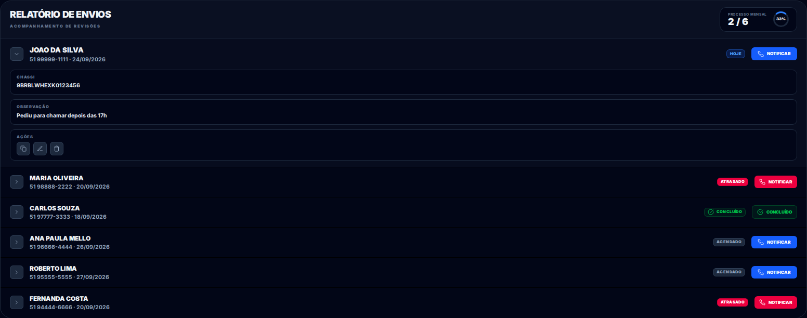
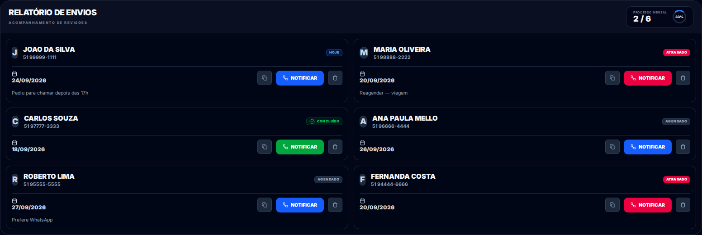
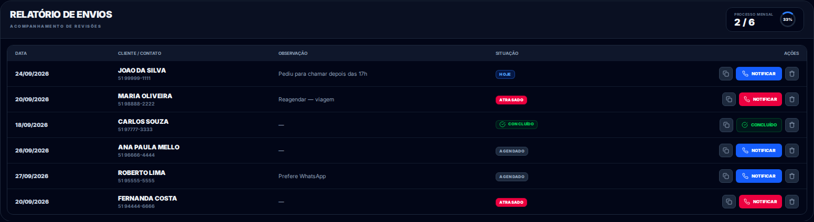
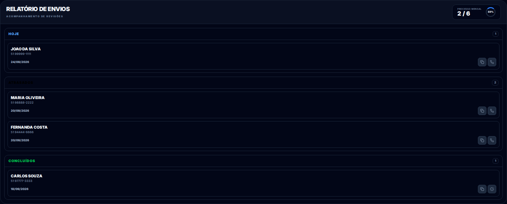
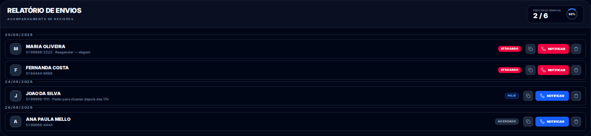

# Ideias de layout — Relatório de Envios (aba Whats)

Simulações com **dados de exemplo** (nada foi implementado ainda). Clique nas imagens para ver
em tamanho maior. Me diga os números que você gostou (pode combinar, ex.: "1 com as ações da 7")
que eu aplico.

O problema atual: cada contato vira uma **linha muito comprida** com fonte pequena. As propostas
abaixo atacam isso de três formas: **mais espaço por contato** (cartões/linhas altas),
**colunas alinhadas** (tabela) ou **visão por situação** (kanban).

---

## 1. Cartões em 2 colunas
Cada contato vira um cartão com nome grande, contato/chassi e observação; data e ações embaixo.
**Prós:** muito legível, aproveita a largura em 2 colunas. **Contras:** menos contatos visíveis por tela.

## 2. Linhas altas (1 por linha)
Nome em cima, contato/chassi embaixo, colunas fixas para data, situação e ações.
**Prós:** boa leitura em lista, comparável. **Contras:** rolagem mais longa.

## 3. Cartões compactos em 3 colunas
Só nome, data e situação. **Prós:** visão geral rápida (quantos hoje/atrasados).
**Contras:** esconde contato/observação (precisa abrir).

## 4. Tabela com colunas nomeadas
Cliente · Contato · Envio · Observação · Situação · Ações, com fonte 14–16px e colunas alinhadas.
**Prós:** fonte legível, tudo visível, ordem natural. **Contras:** exige janela larga (ou 2 linhas na coluna Cliente).

## 5. Faixa de status colorida
Linha única com um traço de cor à esquerda (azul hoje / vermelho atrasado / verde concluído).
**Prós:** identifica o status num relance. **Contras:** a observação fica inline (pode truncar).

## 6. Linha expansível (sanfona)
Resumo curto por contato; ao abrir mostra chassi, observação e ações em cartõezinhos.
**Prós:** compacto e detalhado quando precisa. **Contras:** exige clique para ver os detalhes.

## 7. Cartões grandes em 2 colunas com ações destacadas
Avatar com inicial, nome grande e botão **Notificar** maior.
**Prós:** o mais legível de todos; bom para uso no balcão. **Contras:** menos contatos por tela.

## 8. Tabela densa zebrada
Cabeçalho fixo, linhas ~56px, data em coluna própria e ações agrupadas.
**Prós:** mostra muitos contatos sem "letra miúda", zebrado ajuda a seguir a linha.
**Contras:** observação curta (truncada com tooltip).

## 9. Kanban por situação
Colunas **Hoje / Atrasados / Concluídos** com cartõezinhos.
**Prós:** acompanhamento visual do processo mensal. **Contras:** muda o fluxo (não é mais lista).

## 10. Agrupado por dia
Blocos por data ("20/09", "24/09"…) com linhas médias.
**Prós:** facilita ver o que vence em cada dia. **Contras:** mais cabeçalhos, menos denso.

---

### Minha recomendação
- Se a prioridade é **ler o nome/contato sem apertar os olhos**: **1 (cartões 2 colunas)** ou
  **7 (cartões grandes)** — a 7 é a mais confortável.
- Se a prioridade é **ver muitos contatos**: **8 (tabela densa)** ou **4 (tabela com colunas)**.
- Meio-termo: **5** (faixa de status + linha alta) ou **2** (1 por linha com nome grande).
- Acho que **1** é o melhor custo-benefício: mantém a essência da tabela, mas dá respiro e
  permite nome em 18–20px com as ações maiores.

Pode responder tipo: "quero a 1, mas com a observação embaixo e o botão igual ao da 7".
