# Ideias de layout — cores novas do Tire Flyer (15 sugestões)

15 novas formas de apresentar os valores, agora com **paletas de cores diferentes** — nada de
azul com verde. Simulações com os **dados de exemplo** (medida **265/60R18**, 6 pneus), no
tamanho real da saída (**750px**). **Nada foi implementado** — o app continua igual (o
Clássico segue como padrão e a troca de layout da v0.20.0 não mudou).

> Observação: nas imagens usei a fonte **Inter** como substituta da fonte do sistema — é só para
> a prévia sair igual em qualquer PC.

Me diga os números que gostou (pode combinar: "a 4 com o preço da 11", "a cor da 5 na tabela da 9"…)
que eu aplico.

---

## 01 — Laranja Queima-Estoque

Cartões com dois quadros: 10x em branco com borda laranja e **à vista em laranja cheio**; fundo
creme. Cabeçalho laranja com plaquinha preta.
**Bom para:** liquidação agressiva, mês de promoção. **Contra:** laranja em tudo pode cansar.

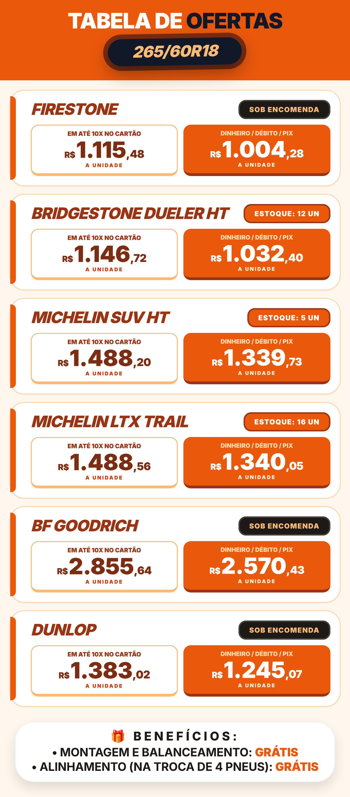

## 02 — Vermelho Racing

Faixas horizontais: marca no topo, **faixa vermelha do à vista** e faixa preta do 10x, com
listra quadriculada de corrida no cabeçalho.
**Bom para:** oficina/performance, visual esportivo. **Contra:** vermelho forte em valores altos.

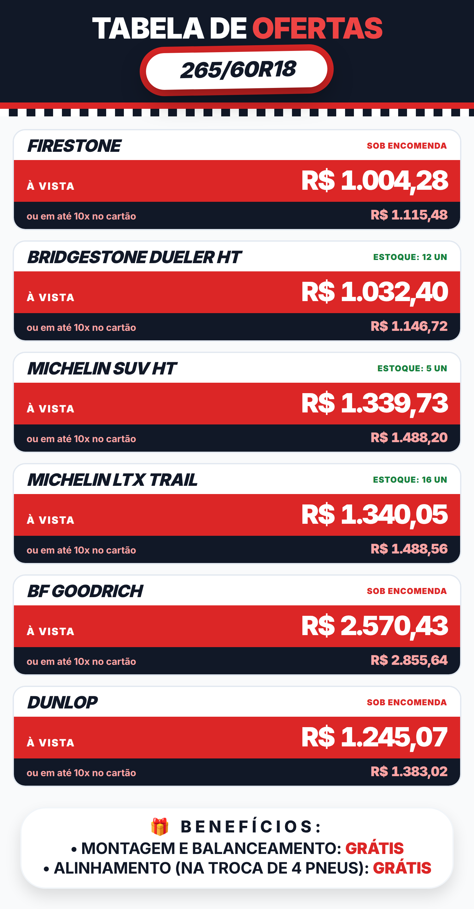

## 03 — Preto & Dourado

Lista premium sem caixas, **fundo preto**, marca em dourado e preço à vista grande em branco,
linhas finas.
**Bom para:** pneus premium/SUV, cliente de ticket alto. **Contra:** flyer escuro gasta mais
tinta se imprimir e chama menos atenção no feed.

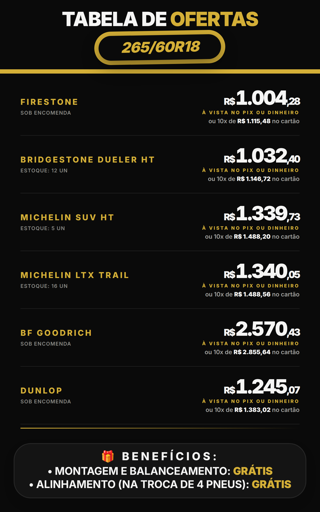

## 04 — Roxo Neon

Grade de mini-cartões em 2 colunas: **à vista em roxo** e o 10x num **chip verde-limão**;
bolinha de estoque.
**Bom para:** visual jovem/moderno, muitos pneus. **Contra:** roxo não é a cor do setor —
diferencia, mas foge do padrão automotivo.

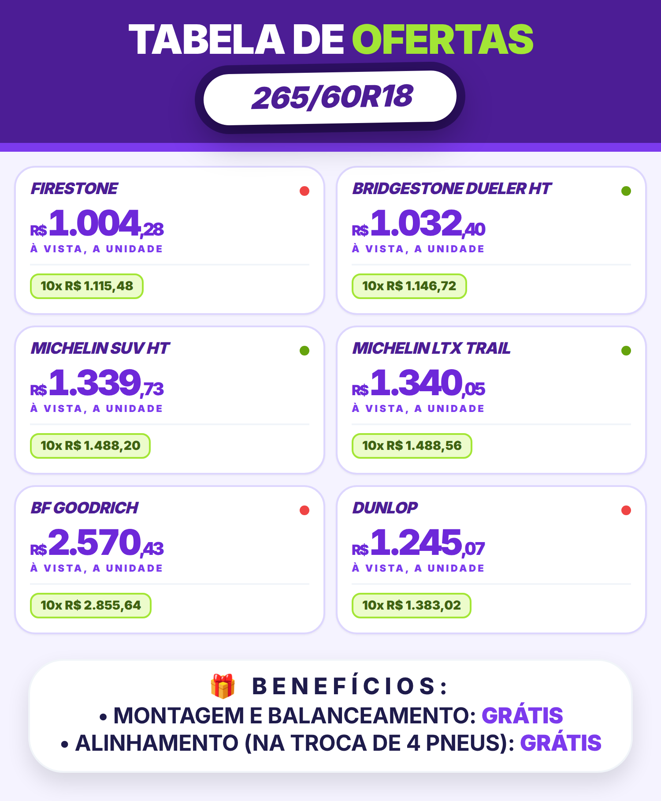

## 05 — Grafite & Limão

Tabela escura compacta com **preços à vista em verde-limão** e linhas zebradas escuras.
**Bom para:** quem quer o layout de tabela (o mais denso) com pegada tecnológica.
**Contra:** mesma questão do fundo escuro do 03.

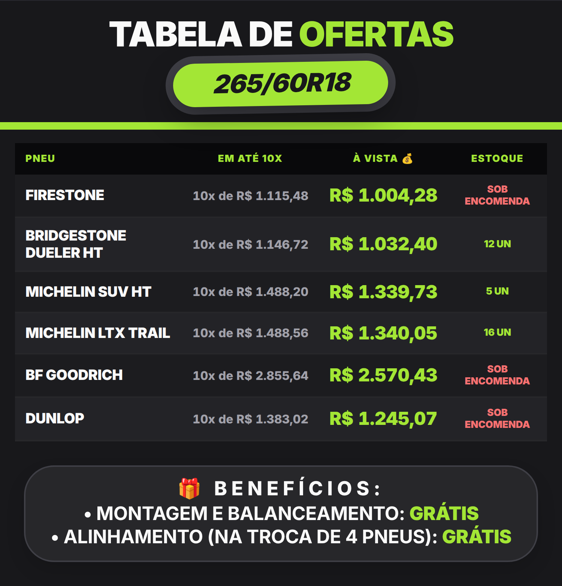

## 06 — Petróleo & Coral

Faixas duplas: **petróleo** para dinheiro/Pix e **verde-escuro** para o cartão, com valores em
coral.
**Bom para:** contraste elegante sem ser berrante; funciona bem no celular. **Contra:** o coral
é mais decorativo que "promoção".

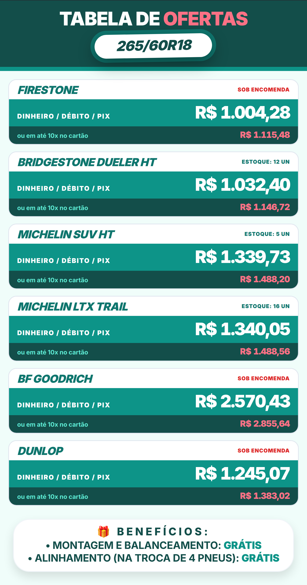

## 07 — Bordô & Areia

**Cupom com recortes laterais** (estilo ticket): marca e 10x à esquerda, preço à vista bordô à
direita, fundo areia.
**Bom para:** campanha de PIX/à vista, visual de cupom. **Contra:** o recorte do cupom usa
espaço lateral (menos largura útil).

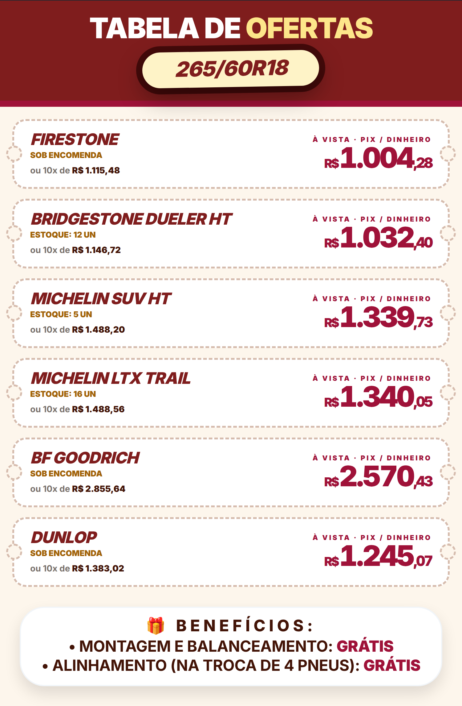

## 08 — Magenta & Azul-noite

**DE/POR**: preço antigo riscado, POR em magenta e **selo rosa "você economiza R$ X"**.
**Bom para:** evidenciar desconto; ótimo com público feminino. **Contra:** magenta é ousado
para o setor.

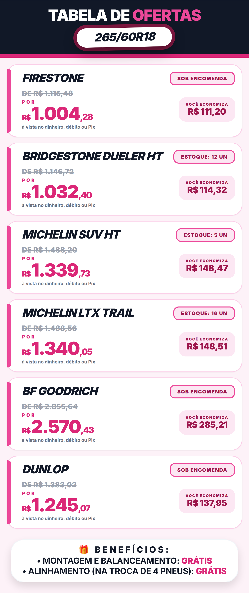

## 09 — Amarelo Encarte

Estilo **encarte de jornal**: tabela com faixa hazard amarela/preto, **carimbo de estoque** e
chamada de contato no rodapé.
**Bom para:** parecer anúncio de jornal/mercado, preço muito direto. **Contra:** visual mais
"popular", menos sofisticado.

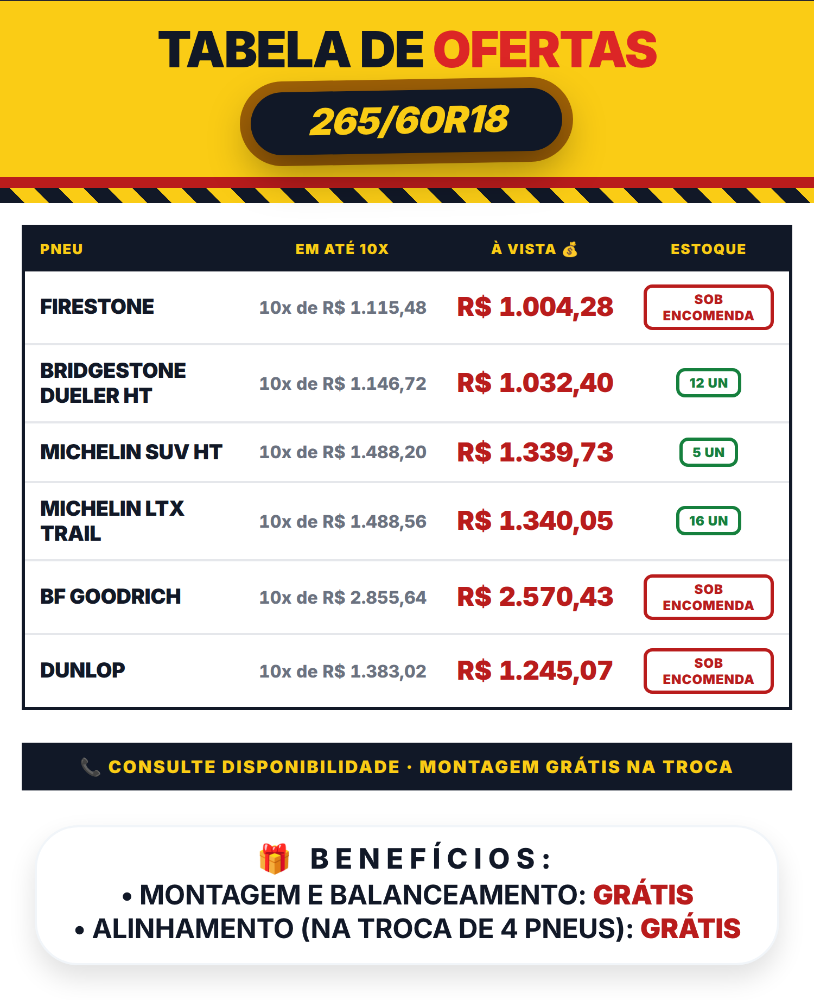

## 10 — Ciano Elétrico

Cards escuros com **preço à vista ciano e brilho**, plaquinha do 10x à direita.
**Bom para:** público jovem/tuning, foto de perfil noturna. **Contra:** como o 03/05, escuro.

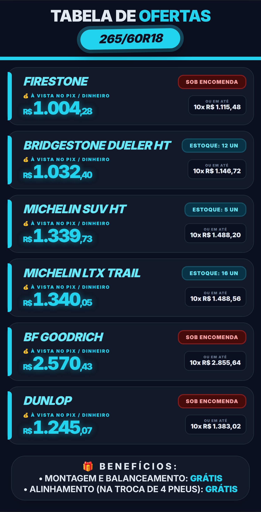

## 11 — Cobre & Creme

**Etiqueta lateral com a inicial do pneu**, nome em cobre e preço à vista central; fundo creme.
**Bom para:** ser elegante sem ser preto/dourado — combina com carro premium e café da manhã.
**Contra:** a inicial repete em marcas iguais (dois Michelin = dois "M").

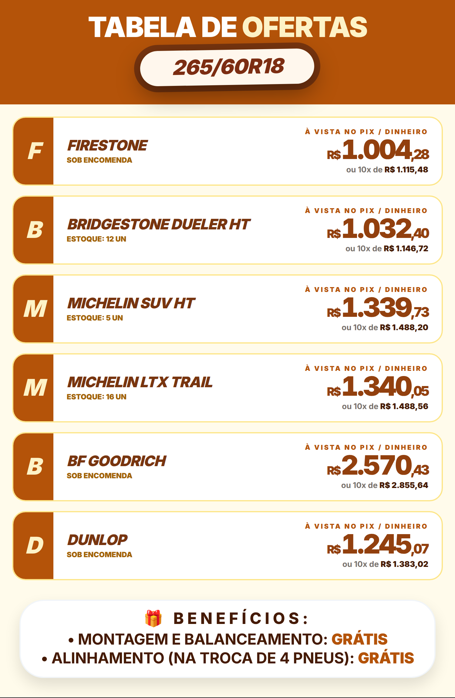

## 12 — Carbono & Vermelho

Dark minimal: **preço à vista branco gigante**, 10x vermelho, separadores finos, quase sem caixas.
**Bom para:** quem quer o 03/10 com mais impacto ("vermelho de oferta"). **Contra:** escuro.

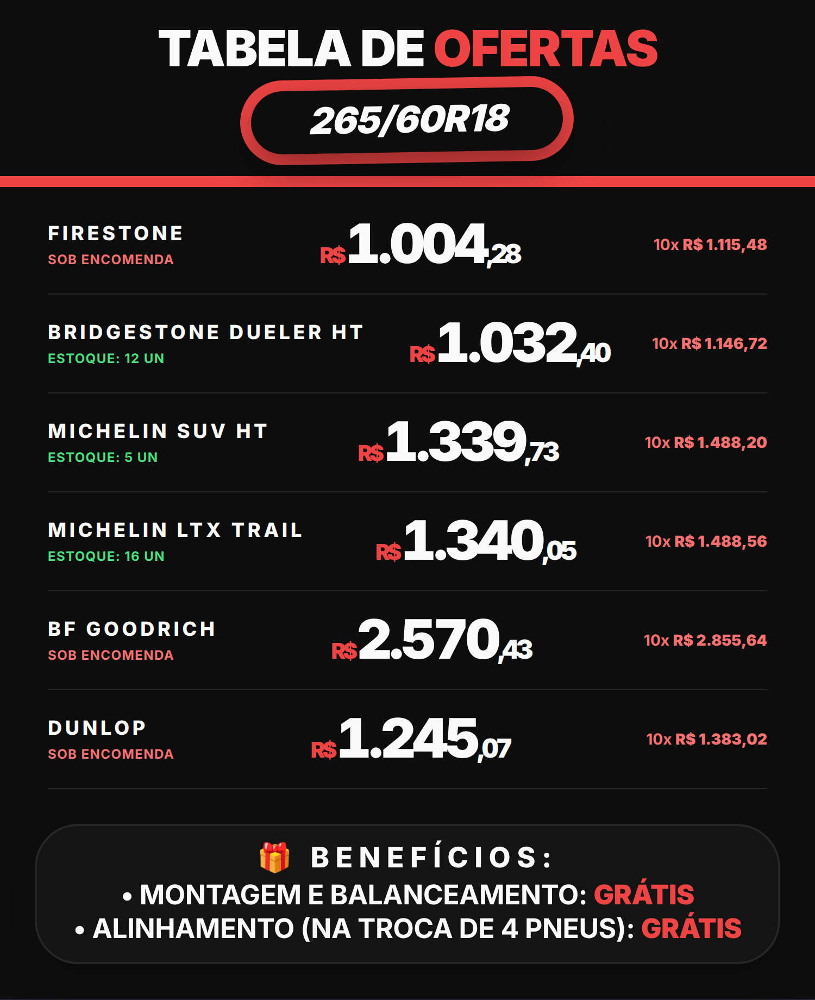

## 13 — Floresta & Ouro

Faixas duplas **verde-floresta (à vista)** e **amarelo-ouro (10x)** com borda dourada.
**Bom para:** 4x4/pickup, público agro. **Contra:** combinação verde+amarelo pode lembrar
bandeira; o dourado não aparece em impressão simples.

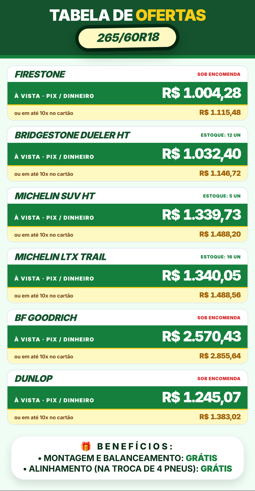

## 14 — Prata & Azul Técnico

**Fichas em grade 2 colunas** com linhas prateadas, "À PRAZO 10x / À VISTA" e valores azuis.
**Bom para:** quem gosta do layout de tabela mas quer algo mais claro e organizado.
**Contra:** visual de "catalogão", menos emoção de oferta.

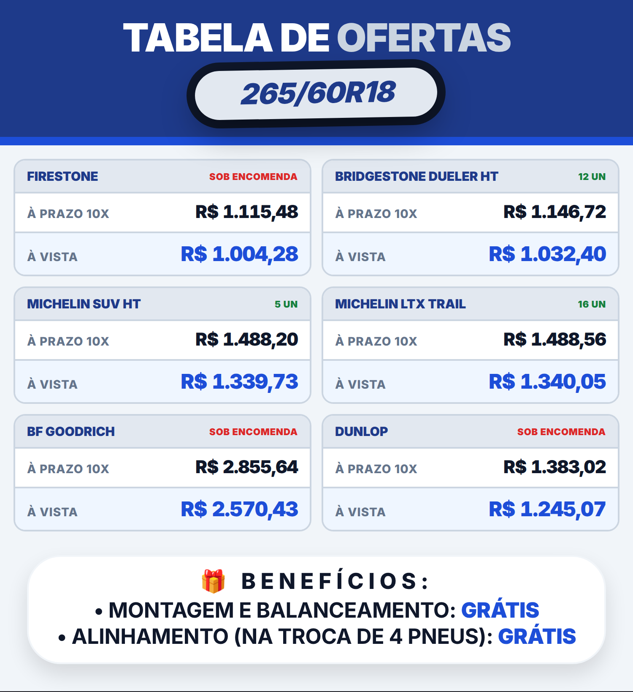

## 15 — Tangerina & Marinho

Cartão com **corte diagonal**: lado branco com marca e 10x, lado **laranja com o à vista**.
**Bom para:** destaque geométrico sem mudar muito a estrutura; laranja forte + azul clássico.
**Contra:** o corte diagonal "come" um canto do cartão (menos área para texto).

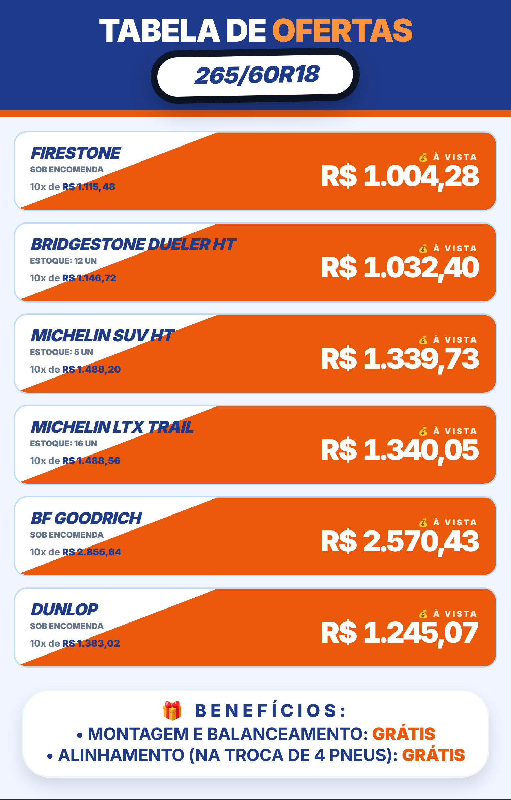

---

### Minha recomendação

- **Mais impacto de oferta:** 01 (laranja), 09 (encarte) ou 15 (diagonal) — laranja/amarelo são
  as cores que mais chamam atenção em promoção.
- **Mais elegante/premium:** 03 (preto e dourado) ou 11 (cobre e creme).
- **Mais "moderno":** 04 (roxo neon), 10 (ciano) ou 12 (carbono e vermelho).
- **Para testar sem sair do azul de vez:** 14 (prata e azul técnico) — mantém a família do tema
  atual, só que mais claro.
- **Combinação que eu faria:** estrutura da **05/09 (tabela compacta)** com a paleta da **01
  (laranja/preto)** — é a que parece mais "promoção de loja de pneus" de verdade.

Pode responder tipo: "quero a estrutura da 4 com a cor da 9" que eu monto.
