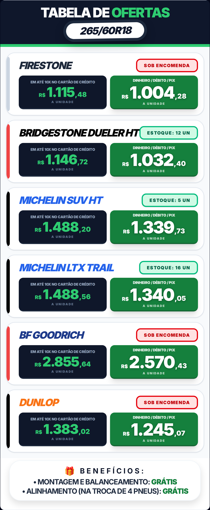
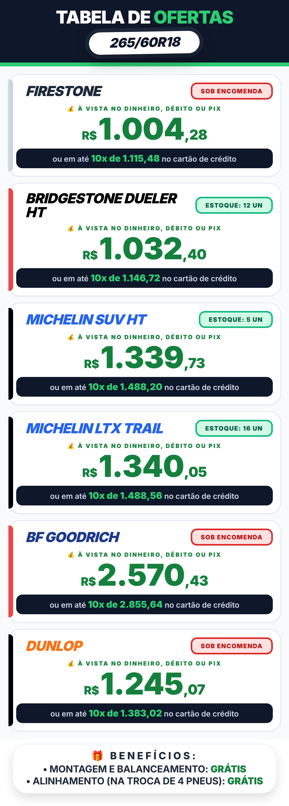
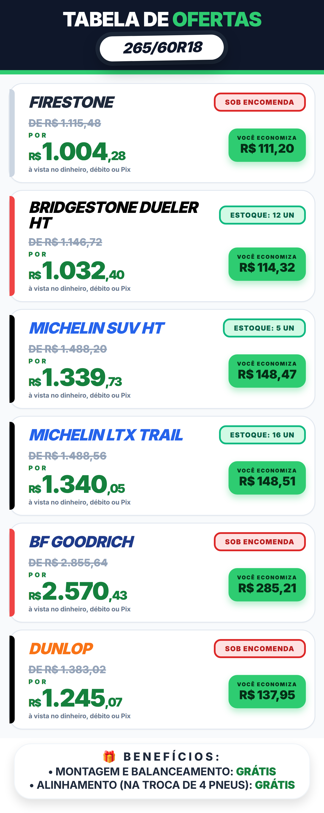
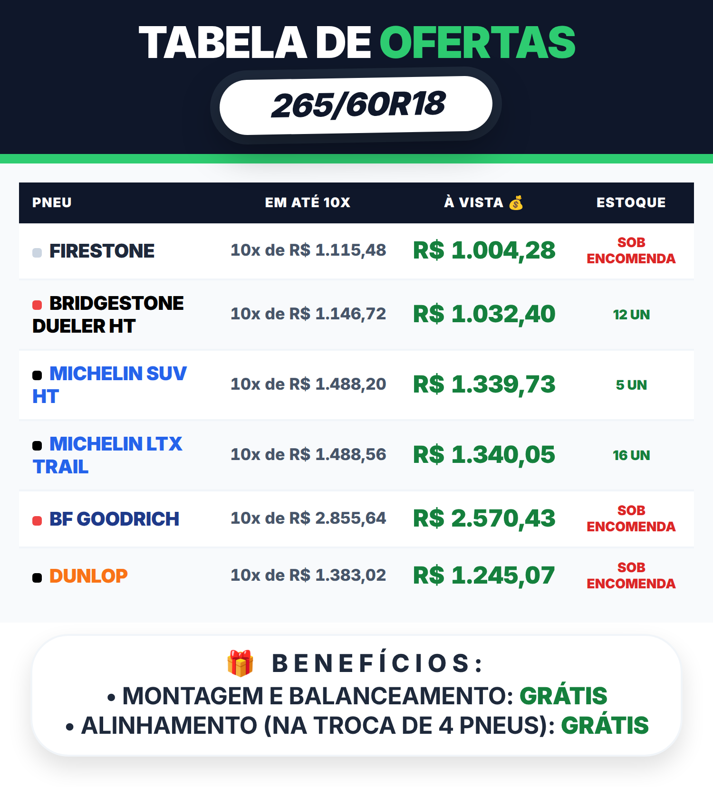
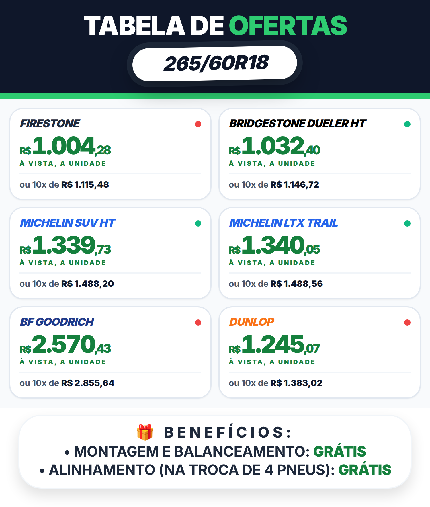
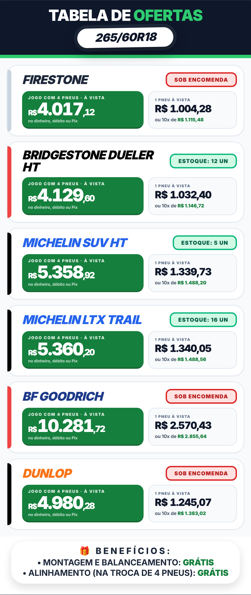
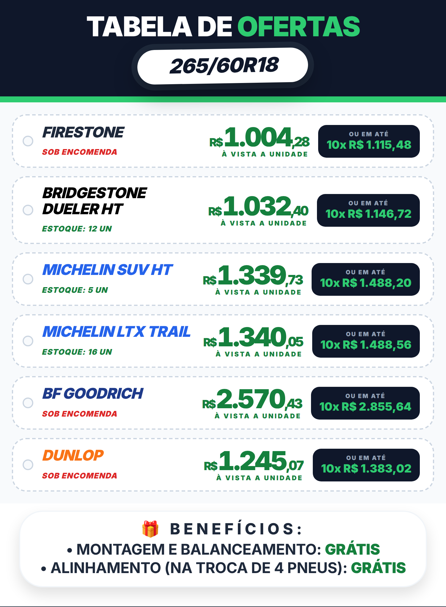
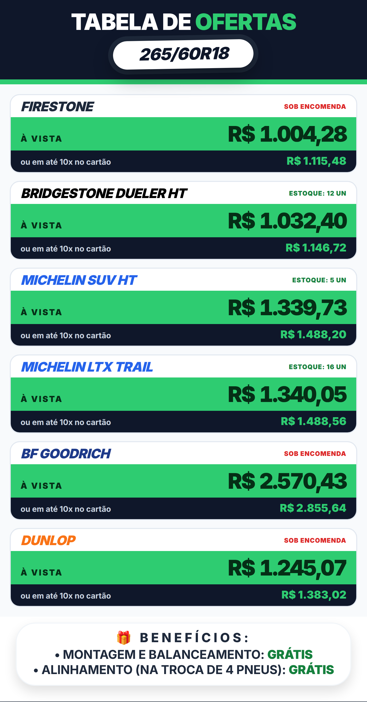
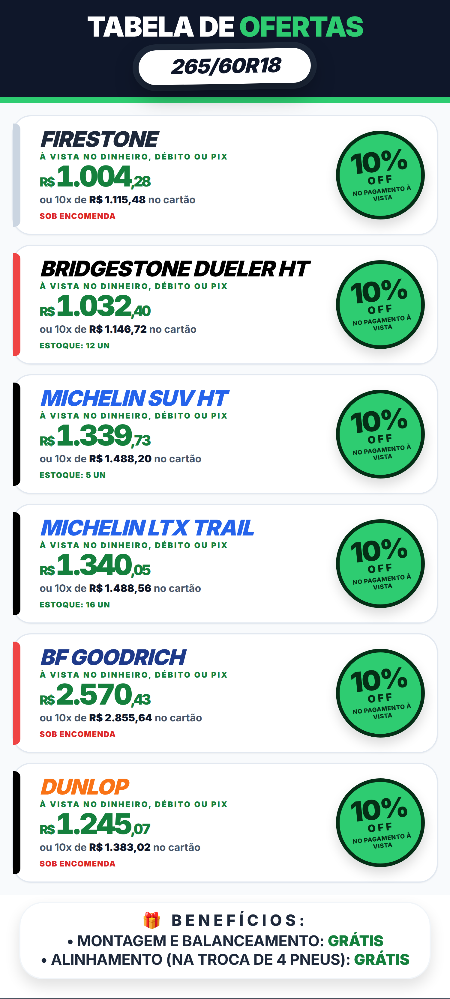
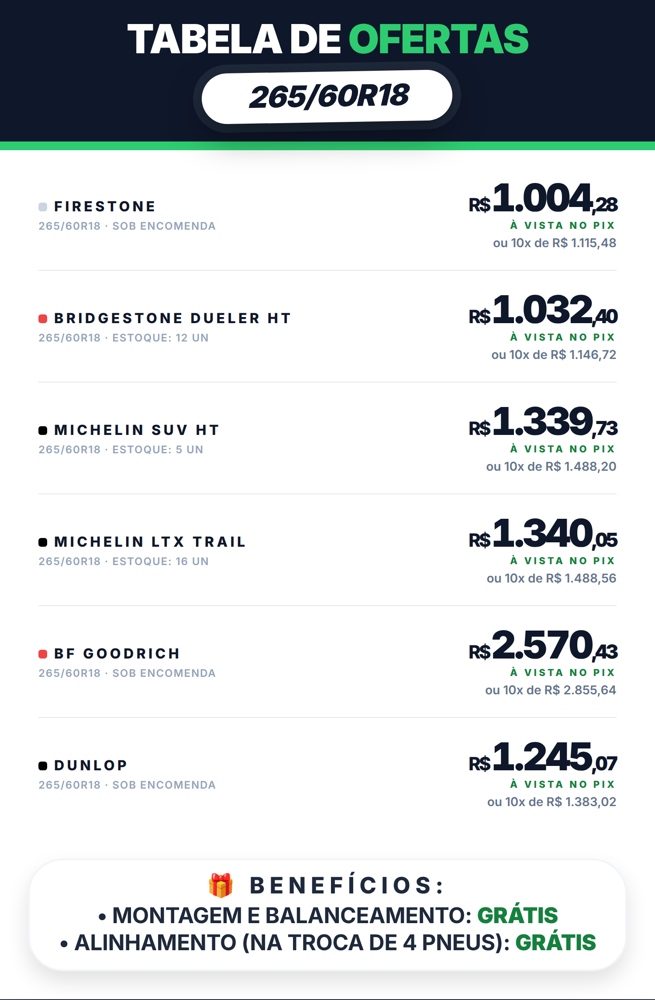

# Ideias de layout — valores do Tire Flyer

10 formas diferentes de **apresentar os valores dos pneus** no flyer. Simulações com os **dados
de exemplo** (medida **265/60R18**, 6 pneus), no mesmo tamanho da saída real (**750px**).
**Nada foi implementado** — o app continua igual. Me diga os números que você gostou (pode
combinar, ex.: "a 2 com o selo da 9") que eu aplico na aba Tire Flyer.

> Observação: nas imagens usei a fonte **Inter** no lugar do `font-sans` do sistema — é só para
> a prévia ficar igual em qualquer PC. As cores das marcas (barra lateral) seguem as regras do
> flyer atual.

---

## Hoje (referência)

O flyer atual, capturado do próprio app, para comparar: dois quadros por pneu (10x no cartão em
escuro, à vista em verde) e selo de estoque.

---

## 1. Clássico (como é hoje)

Dois quadros por pneu: **10x no cartão** (escuro, valor verde) e **à vista** (verde, valor
branco). É a linha de base — só serve para comparar as outras.

**Prós:** já é o que o cliente conhece; tudo bem separado. **Contras:** ocupa bastante altura.

## 2. À vista em destaque

O **preço à vista fica gigante no centro** do cartão; o 10x vira uma faixa fina escura embaixo.

**Prós:** bate o olho e vê o menor preço (âncora de preço); flyer mais "promocional".
**Contras:** quem compra parcelado vê o valor menor em segundo plano.

## 3. DE / POR com economia

Preço "de" (10x) riscado, **"por" à vista em verde** e selo **"você economiza R$ X"** (calculado
na hora, é a diferença real entre parcelado e à vista).

**Prós:** mostra a economia em R$ — forte apelo de desconto. **Contras:** dois preços no mesmo
cartão podem confundir se o cliente não ler o rótulo.

## 4. Tabela de ofertas

Os pneus viram **linhas de uma tabela**: `Pneu · Em até 10x · À vista · Estoque`.

**Prós:** o **mais compacto** — cabe muito mais pneu na folha e o cliente compara na vertical.
**Contras:** visual menos "promoção", mais "lista de preços"; fonte um pouco menor que os cartões.

## 5. Grade em 2 colunas

**Mini-cartões de dois em dois**, com à vista grande e o 10x numa linha fina embaixo. O
estoque vira uma bolinha verde (tem) / vermelha (sob encomenda).

**Prós:** mostra 2 pneus por linha, equilibra quantidade e legibilidade. **Contras:** cartões
menores; marcas de nome comprido ocupam 2 linhas.

## 6. Preço do jogo (4 pneus)

Caixa verde com o **valor do jogo completo (4 pneus à vista)** + caixa menor com o unitário e o
10x.

**Prós:** fala a língua do cliente ("quanto custa trocar os 4"); aumenta o ticket.
**Contras:** gera valores altos; quem troca só 1 ou 2 pode se assustar.

## 7. Etiqueta de preço

Cada pneu vira uma **etiqueta de loja** (com furo), à vista em destaque no meio e o 10x numa
plaquinha escura à direita. Estoque pequenininho embaixo da marca.

**Prós:** visual de liquidação/queima de estoque, chama atenção. **Contras:** menos "clean";
a etiqueta precisa de espaço lateral.

## 8. Faixas duplas

Faixa **verde "À VISTA R$ X"** e faixa **escura "10x de R$ Y"** por pneu, ocupando a largura
toda.

**Prós:** altíssimo contraste — funciona bem na foto/miniatura do WhatsApp. **Contras:**
mais "bruto"; o nome da marca fica pequeno em cima.

## 9. Selo de desconto

Preço à vista destacado + **selo redondo "10% OFF no pagamento à vista"** (a porcentagem é
calculada por pneu — no exemplo dá 10% em todos).

**Prós:** o desconto em % vende melhor que o valor riscado para muita gente.
**Contras:** selo redondo grande ocupa espaço; se o desconto variar muito, fica irregular.

## 10. Minimalista premium

Sem caixas coloridas: marca em cima, **preço à vista grande e elegante**, separadores finos e
10x discreto embaixo.

**Prós:** o mais sofisticado/limpo; respira. **Contras:** menos impacto de "oferta"; menos cor
das marcas (só um tracinho antes do nome).

---

### Minha recomendação

- Se o objetivo é **vender o à vista**: **2** (preço gigante) ou **9** (selo 10% OFF).
- Se o objetivo é **mostrar desconto**: **3** (economia em R$) — é a mais honesta, pois o valor
  vem do próprio cálculo (parcelado − à vista).
- Se entra **muita marca** na tabela: **4** (tabela) ou **5** (grade 2 colunas).
- Para **impacto no WhatsApp** (miniatura): **8** (faixas) ou **2**.
- Para um visual mais **premium**: **10**.
- Minha aposta de melhor custo-benefício: **2** para o preço e **9** para o selo — ou combinar
  **2 + 3** (à vista gigante + economia em R$).

Pode responder tipo: "quero a 2, mas com o selo da 9 e o estoque da 8".
